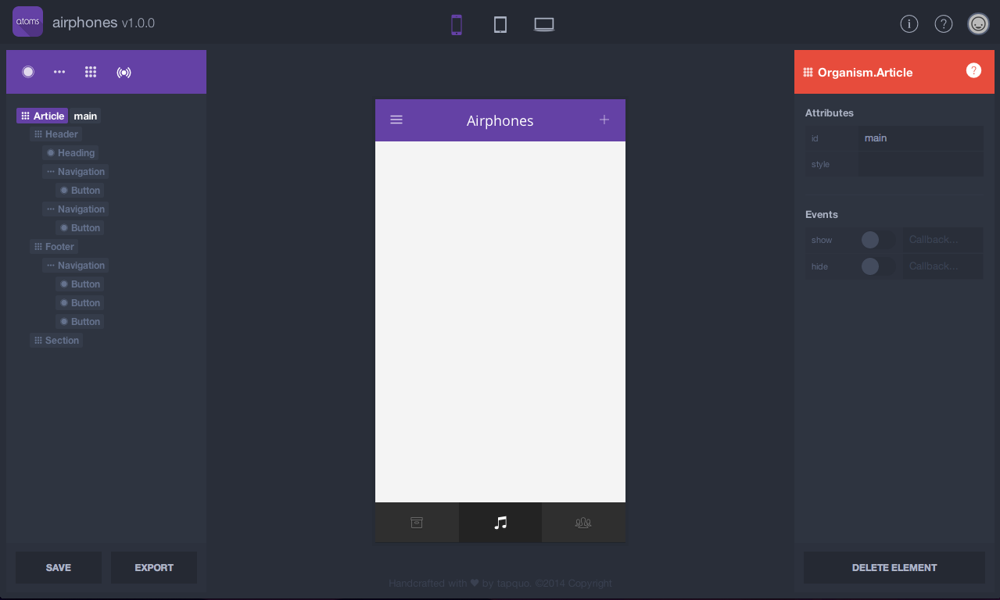
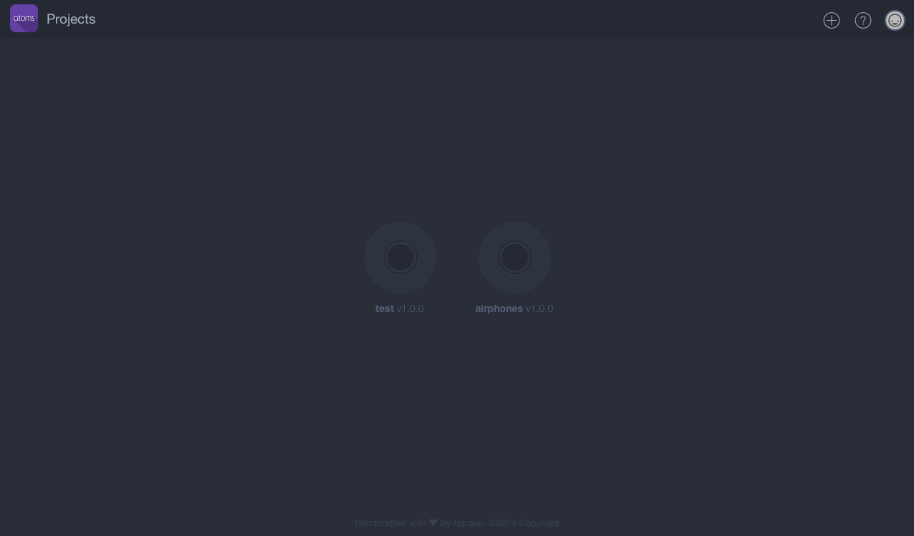

#Atoms
## 8 - Atoms.IDE

Al finalizar el capítulo anterior hablamos de [Atoms.App](https://github.com/tapquo/atoms-app) una extensión del *core* de Atoms que nos ofrece todo una lista de elementos: *Atom*, *Molecule* y *Organism* específicos para la creación de Web Applications. Ahora vas a conocer otra extensión del *core*, Atoms.Ide, la cual se encarga de gestionar Atoms.App para poder diseñar Web Applications por medio de un IDE:

Como puedes ver se trata de un completo IDE el cual te permitirá generar toda la estructura de tu aplicación y como aprendiste en anteriores capítulos generará toda la fusión entre *Atom*, *Molecule* y *Organism*:

  - Pudiendo definir los atributos especiales de cada elemento
  - Gestionando los atributos especiales `events`, `callbacks`, `bind`... 
  - Previsualizando la jerarquia de elementos
  - Exportando un proyecto
  
Atoms.Ide y [Atoms.App](https://github.com/tapquo/atoms-app) son 2 extensiones que demuestran la enorme capacidad que tiene Atoms, por ejemplo Atoms.App es utilizado por Atoms.Ide para poder crear otras instancias de Atoms.App. Parece un travalenguas pero lo podemos llamar modo *Inception*.

### 8.1 - Comenzando un nuevo proyecto
Para comenzar un nuevo proyecto con Atoms.Ide debes estar [registrados](http://atoms.tapquo.com/session) en la plataforma como un *Atoms Developer*. Una vez esto 

Una vez esto entraras en la vista de proyectos donde tendrás una lista con todas tus instancias de Atoms.App asi como 

En el caso de que queramos crear una nueva, unicamente tendrémos que pulsar sobre el icono (+) situado en la parte superior derecha donde nos aparecerá la siguiente ventana:

