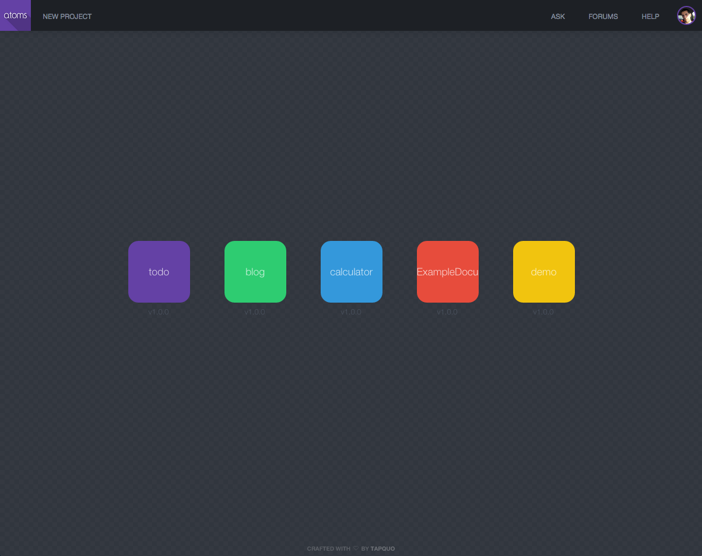
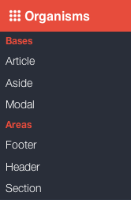
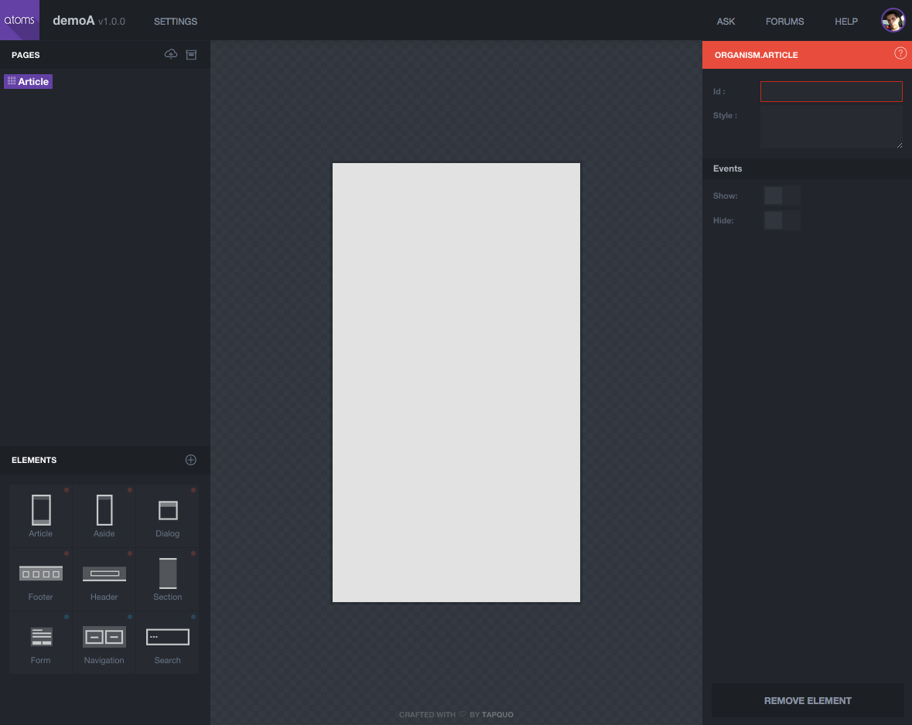
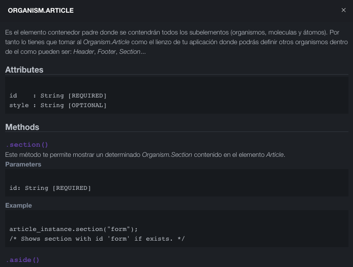
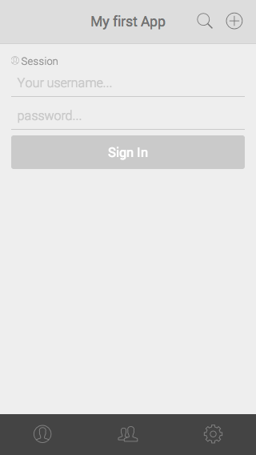
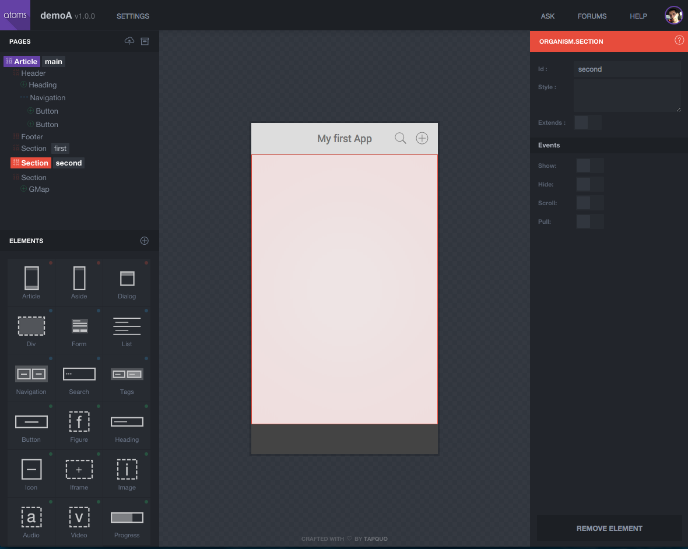
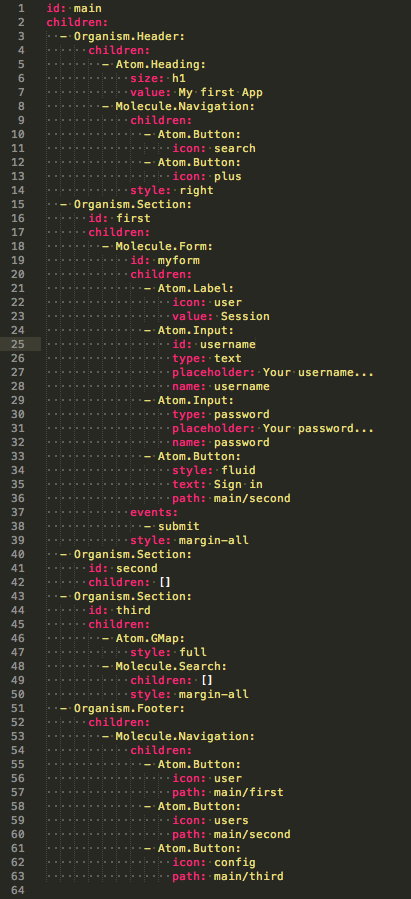

#Atoms
## 8 - Atoms.IDE

Al finalizar el capítulo anterior hablamos de [Atoms.App](https://github.com/tapquo/atoms-app) una extensión del *core* de Atoms que nos ofrece todo una lista de elementos: *Atom*, *Molecule* y *Organism* específicos para la creación de Web Applications. Ahora vas a conocer otra extensión del *core*, Atoms.Ide, la cual se encarga de gestionar Atoms.App para poder diseñar Web Applications por medio de un IDE:


Como puedes ver se trata de un completo IDE el cual te permitirá generar toda la estructura de tu aplicación y como aprendiste en anteriores capítulos generará toda la fusión entre *Atom*, *Molecule* y *Organism*:

  - Pudiendo definir los atributos especiales de cada elemento
  - Gestionando los atributos especiales `events`, `callbacks`, `bind`... 
  - Previsualizando la jerarquia de elementos
  - Exportando un proyecto
  
Atoms.Ide y [Atoms.App](https://github.com/tapquo/atoms-app) son 2 extensiones que demuestran la enorme capacidad que tiene Atoms, por ejemplo Atoms.App es utilizado por Atoms.Ide para poder crear otras instancias de Atoms.App. Parece un travalenguas pero lo podemos llamar modo *Inception*.

### 8.1 - Comenzando un nuevo proyecto
Para comenzar un nuevo proyecto con Atoms.Ide debes estar [registrados](http://atoms.tapquo.com/session) en la plataforma como un *Atoms Developer*. Una vez esto 


Una vez esto entraras en la vista de proyectos donde tendrás una lista con todas tus instancias de Atoms.App asi como 



En el caso de que queramos crear una nueva, unicamente tendrémos que pulsar sobre el icono (+) situado en la parte superior derecha donde nos aparecerá la siguiente ventana:


En esta ventana unicamente tenemos que elegir el nombre de nuestra instancia de Atoms.App asi como una breve descripción de la misma. Tras ello comenzaremos con lo que consideramos una verdadera revolución a la hora de crear *Web Applications*, ya de por si Atoms es un paradigma del desarrollo de muy alto nivel pero con la extensión Atoms.Ide la experiencia se convierte en una experiencia inigualable. Vamos a familiarizarnos con el IDE:


Si pulsamos sobre el icono `(?)` situado en la parte superior derecha entraremos en el modo ayuda, el cual nos describirá como funciona toda la interfaz propuesta. 


Tenemos 4 areas bien diferenciadas:

  - SUPERIOR: Información del proyecto y usuario.
  - IZQUIERDA: Elementos *Atom*, *Molecule*, *Organism* y *Extension* utilizados en el proyecto.
  - CENTRAL: Lienzo donde podemos ver el comportamiento de estos elementos.
  - DERECHA: Atributos del elemento seleccionado.
  
Si quisieramos modificar algún dato de tu proyecto o crear una nueva versión del mismo debes pulsar en el icono (i) situado en la parte superior derecha:


Desde ese mismo area si pulsamos sobre el *avatar* podrás modificar tus datos personales como Atoms Developer:


En el caso de que quieras regresar a la vista de proyectos disponibles unicamente tienes que pulsar sobre el icono de Atoms, en la parte superior izquierda. 

### 8.2 Elementos
Como estudiaste en los capítulos anteriores Atoms te provee de un sistema de elementos los cuales estan agrupados por niveles de complejidad y responsabilidad. Para conocer los elementos actuales se encuentran agrupados en la siguiente barra de navegación:


Poniendonos encima de cada icono descubrirémos el listado de elementos: *Atom*, *Molecule* y *Organism*:




En este mismo capítulo descubrirás las extensiones de Atoms.App, recordando que Atoms es un sistema Atómico e infinito en la creación de nuevos elementos.


### 8.3 Drag & Drop
Como ya sabes Atoms se basa en la creación de un sistema complejo a partir de elementos más sencillos, y en nuestro IDE se traduce de igual manera por lo que comenzaremos arrastrando un elemento Organism e iremos creando su composición interna a base de otros elementos: *Atom*, *Molecule* e incluso *Organism*. Si nos ponemos sobre el icono de Organisms verémos que existen 2 areas:

  - Bases: Contenedores maestros
  - Areas: Subcontenedores que pueden añadirse a los contenedores maestros
  
Ambas son *Organisms* no difieren en absolutamente nada, pero Atoms.App ha creado diferentes comportamientos y responsabilidad para estos elementos para que sea mas sencilla la composición de las vistas de nuestra Web Application. Por lo que comenzarémos arrastrando el `Organism.Article` sobre nuestro lienzo quedando la vista de la siguiente manera:



Como has podido comprobar al arrastrar el elemento sobre el canvas (lienzo) este se ha marcado con un color rojo (Organism) indicando que es aceptado. A su vez puedes comprobar como la parte de atributos de elemento ha detectado que has seleccionado un `Organism.Article` y nos da la posibilidad de cambiar los atributos del mismo. Vemos que el atributo *id* es obligatorio al ser marcado de color rojo y que podemos tambien activar los `events` disponibles e incluso definir los `callbacks`; algo que como viste teníamos que hacerlo por medio del constructor de una determinada clase y en el caso de los *Organism* tambien podiamos hacerlo por medio de un fichero scaffold (json o yaml); con Atoms.Ide es mucho más sencillo mantener los atributos. 

En el caso de que tengas algún tipo de consulta de un determinado elemento puedes pulsar sobre el icono `(?)` que se encuentra en la sección de atributos y aparecerá toda la documentación disponible para ese elemento. 



Ahora vamos a seguir diseñando la estructura de nuestra WebApplication arrastrando al canvas los Organism: *Header*, *Footer* y *Section* sobre `Organism.Article`. Como resultado obtendrémos:


Como vemos el area de elementos va creando la jerarquia y `Organism.Article` se convierte en un contenedor de `Organism.Header`, `Organism.Footer` y `Organism.Section` que como podemos comprobar aunque el orden ha sido *Header*, *Footer* y *Section* son representados de la siguiente manera *Header*, *Section* y *Footer*, esto es así porque Atoms.App tiene un sistema implicito de *weights* para todos sus elementos dandonos la posibilidad de no poder equivocarnos en el diseño visual de nuestras Web Applications. Como has podido comprobar ahora podemos seleccionar cualquier elemento y el area de atributos cambia con sus propiedades en (el caso de Atoms.Header vemos que no dispone de `events`). 

Antes de pasar a la modificación de atributos vamos a arrastrar un `Atom.Heading` dentro de nuestro `Organism.Footer` comprobando que esa acción es imposible puesto que este no tiene como `@available` ese *Atom*. En cambio si lo intentamos arrastrar al resto de *Organism* vemos que estos se activan con el característico color rojo indicando que si es aceptado en su jerarquia:


En nuestro caso vemos que al ser arrastrado el `Atom.Heading` sobre `Organism.Header` se marca de color verde (Atom) tanto el elemento en el canvas como el area de atributos. Por último pulsa el boton "Save", situado en la parte inferior izquierda, para guardar el estado actual de tu proyecto o bien pulsa la combinación de teclas CTRL+SAVE.

### 8.4 Atributos
Ahora vas a comprobar como el *Core* de Atoms hace acto de presencia ya que como aprendiste en el capítulo destinado a [Eventos](https://github.com/soyjavi/atoms-documentation/blob/master/ES/06.md) existe un sistema de comunicación *Bubbling*/*Tunneling*. En nuestro proyecto vamos a comenzar a modificar los atributos del elemento `Atom.Heading` desde el area de atributos:


Al cambiar cualquier atributo veremos como tanto el area de elementos como el canvas reaccionan en tiempo real a esos cambios, esto es así porque el area de atributos lanza eventos *Bubble* con la información de los nuevos atributos y el resto de elementos, en el caso de que tenga handler, reaccionan a esa información. Ahora vamos a establecer el atributo `text` con el valor `"My First App"` y verémos como reacciona Atoms.Ide:


Ahora vamos a arrastrar un elemento `Molecule.Navigation` en el `Organism.Header` y vamos a establecer los siguientes attributos:

 - `style` a `"right"`: indicando a Atoms.App que lo situe en la parte derecha de su contenedor  
 - `id` a `"menu"`: para crear un simbolo `@menu`
 - `events` activaremos el único evento que existe `select`
 
Con todas estas modificaciones podemos ver el area de elementos crea unos *helpers* para indicarte que has establecido un `id`, has modificado el `style` por defecto y que el elemento publicará `events`.


Ahora vamos a establecer un par de elementos `Atom.Button` dentro de nuestra `Molecule.Navigation`, podemos intentar arrastrarlo sobre el `Organism.Header` y verémos que no los acepta. Estos elementos, dentro de la extensión Atom.App, tienen como proposito realizar algún tipo de acción con `@events` o bien utilizarse como enrutador con el atributo `path`. Como podemos comprobar el evento `touch` esta activado por defecto, y vamos a establecer un `icon` para ello haremos click sobre su input y apareciendo la siguiente ventana:


Buscamos un icono con el texto `"plus"` lo seleccionaremos y vemos como el canvas lo representa automáticamente, para el otro `Atom.Button` realizaremos el mismo proceso seleccionando el icono `"search"` quedando nuestra Molecule.Navigation de la siguiente manera:


Ahora en nuestro `Organism.Footer` vamos a crear otra `Molecule.Navigation` y la vamos a utilizar para navegar entre diferentes `Organism.Section` dentro de nuestro `Organism.Article`. Para ello, antes de comenzar con la enrutación, vamos a establecer el atributo `id` a todos los `Organism.Article`/`Section` que tengamos ya que es necesario para poder utilizar el atributo `path` de los `Atom.Button`. Vamos a dejar una estructura con los siguientes atributos `id`:
 
  - Organism.Article: `main` 
  - Organism.Section: `first` 
  - Organism.Section: `second` 
  - Organism.Section: `third`
  


Ahora ya podemos crear nuestra `Molecule.Navigation`, que contendrá tres botones con el atributo path, para ello tienes que dejar una estructura en tu lista de elementos de la siguiente manera:


  
Como has podido comprobar con cada nuevo `Atom.Button` dentro de un `Molecule.Navigation` se redimensionan los elementos para que todos sean proporcionados. Ahora vamos a comenzar a establecer un `path` a nuestro primer botón y mágicamente al seleccionar una ruta nos aparece un selector con todas las rutas disponibles:


El patrón que utiliza Atoms.App se basa en tomar como vista principal el `Organism.Article` y como subvista cualquiera de los `Organism.Section` que este contenga. En capítulos posteriores verémos como establecer rutas dinámicas con el modulo `Atoms.App.Url`, ahora nos toca establecer a nuestros Atom.Button los atributos `path` e `icon`:
  
  - 1) `main/first` y `person-b`
  - 2) `main/second` y `people`
  - 3) `main/third` y `ios7-cog`
  
Obteniendo como resultado en nuestro *Canvas*:


Viendo como aparece un nuevo helper en el area de elementos indicando que ese botón tiene un comportamiento de enrutador:

 

Ahora vamos a ver como `Atoms.Ide` es capaz de comunicar al enrutador de `Atoms.App` que visualice el `Organism.Section` con el que necesitamos trabajar, tan sencillo como en el area de elementos seleccionar `Section/First`. Ahora que estamos trabajando con nuestro primer `Organism.Section` vamos a establecer el `style` a `"padding"` y crear la siguiente estructura:

 

Ahora vamos a establecer los atributos a cada uno de los elementos *Atom* de `Molecule.Form`:
  
  - `Atom.Label`:
    - icon: person-b
    - text: Session
  - `Atom.Input`:
    - type: text
    - name: username
    - placeholder: Your username...
    - style: big
    - maxlength: 8
  - `Atom.Input`:
    - type: password
    - name: password
    - placeholder: Your password...
  - `Atom.Button`:
    - style: fluid
    - text: Sign In
    
Comprobando que la representación de nuestro formulario en el *Canvas* comienza a tener sentido:

 
    
Ahora vamos a trabajar con el `Organism.Section` que tiene como `id` a `"Second"`, viendo que Atoms.Ide nos lo muestra ocultando automáticamente `"First"`:

 

Con esto finalizamos este capítulo, poco a poco nuestro primer proyecto va cogiendo forma y como estas comprobando todo se basa en *Drag&Drop* (Arrastrar y Soltar) elementos dentro de una jerarquia y estableciendo sus `attributes`.

### 8.5 Extensiones
Como ves la extensión Atoms.App ofrece una gran variedad de elementos *Atom*, *Molecule* y *Organism* para crear tu Web Application. Como hemos comentado en varias ocasiones Atoms ofrece un sistema de extensibilidad muy sencillo el cual vamos a ver en funcionamiento con las extensiones de Atoms.App

Debes tomarte las extensiones como *mini* aplicaciones que ofrecen una funcionalidad muy definida y que la utilizaremos dentro de nuestra Web Application. En nuestro ejemplo vamos a utilizar la extension [Atoms.App.GMaps](https://github.com/tapquo/atoms-app-gmaps) la cual nos ofrece la posibilidad de incluir y controlar Mapas de Google. Como puedes preveer la forma de comunicarnos con estas extensiones será por el sistema de eventos *Bubbling*/*Tunneling*, puesto que el *business code* de cada una de ellas es transparente para nuestra aplicación.

Bien vamos a incluir la extensión Atoms.App.GMaps en nuestro proyecto para ello tenemos que pulsar el botón situado en la parte superior de el area de elementos:

 

Trasn esto nos aparecerá una ventana con todas la extensiones disponibles donde seleccionaremos *"Google Maps"*:


Al seleccionar una extension Atoms.Ide automáticamente carga todos los elementos en la barra de selección con nuestra extensión tendrémos disponible:

  - `Atom.Gmap`: Elemento *Atom* para incluir un mapa dentro de un determinado `Organism.Section` 
  - `Organism.GMap`: Elemento *Organism* el cual nos crea una vista completa para poder buscar posiciones.
 
En el primer ejemplo vamos a arrastrar un elemento `Atom.Gmap` sobre el `Organism.Section` con el id "section", teniendo como resultado:


Como ves la extensión funciona correctamente ya que el mapa de Google es total operativo y al igual que en el resto de elementos podemos obtener la documentación pulsando el icono `(?)` situado en el area de atributos. En el caso de Atom.GMap disponemos de los atributos `id` y `style` y de los eventos `query` y `route`. Además de los atributos que puede gestionar Atoms.Ide existen métodos como `center`, `zoom`, `query`, `marker`, `route`, `routeInstructions` los cuales están disponibles cuando comencemos con el *Business Code*.

Ahora vamos a eliminar nuestro `Organism.Section` con id `"third"` y vamos a sustituirlo por la extension `Organism.GMap`, la cual dispone de varios elementos: `Atom.GMap`, `Molecule.Navigation` y `Molecule.Form`. El resultado sería el siguiente:


Para comprobar que la extensión es totalmente funcional podemos probar a utilizar el buscador introduciendo cualquier dirección, en nuestro caso vamos a buscar *"Bilbao"*:


Con esto finalizamos la introducción a las extensiones, las cuales se convierten en una parte fundalmental a la hora de crear Web Applications más complejas. Cualquier desarrollador puede crear sus extensiones e incluirlas dentro de `Atoms.Ide` para que tanto el como cualquier otro *Atoms Developer* pueda reutilizarla en sus proyectos.


### 8.6 Exportar
Hasta ahora has comprobado que *Drag&Drop* en `Atoms.Ide` te ofrece una capacidad de abstracción a la hora de crear toda la jerarquia de elementos de tu *Web Application*, pudiendo  modificar los atributos de cada uno de ellos para crear el comportamiento que buscas. Conoces como crear un sistema de enrutamiento con el atributo `path` de los elementos `Atom.Button` o `Atom.Link` y la combinación del atributo `id` de `Organism.Article` y `Organism.Section`. Has aprendido que puedes añadir cualquier extensión de `Atoms.App` y tratarla como cualquier elemento.

`Atoms.Ide` no se queda *solo* en esto, además te da la posibilidad de generarte todo el *Scaffold* (andamiaje) de tu proyecto listo para que comiences a desarrollar el Business Code de tu aplicación. Para ello unicamente tienes que pulsar sobre el boton *"export"* situado en la parte inferior del area de elementos, con lo que `Atoms.Ide` generará un fichero zip descargable para que puedas comenzar a desarrollar.

La estructura del proyecto se compone de:
  
  - `/app`: Directorio donde se encuentra todo el proyecto Atoms para exportar.
     - `/assets`: Recursos JavaScript, Images y CSS Stylesheets.
        - `/css`: 
        - `/img`:
        - `/js`:
     - `index.html`: Documento HTML de tu Web Application
     - `LICENSE`: Fichero de licencia
  - `gruntfile.coffee`: Tareas Grunt del proyecto
  - `LICENSE`: Fichero de licencia
  - `package.json`: Módulos NodeJS necesarios para las tareas Grun.
  - `/source`: Directorio donde se encuentran todos los fuentes
     - `/atoms`: Extensiones *Atom*
     - `/entities`: Extensiones *Entity*
     - `/molecules`: Extensiones *Molecule*
     - `/organisms`: Extensiones *Organism*
     - `/style`: CSS Stylesheets del tema de tu aplicación.
   

### 8.7 Comenzando a desarrollar
Una vez descomprimido el archivo zip generado por el IDE debemos ubicarnos con el terminal dentro de la carpeta descomprimida y escribir:

```
sudo npm install
gulp init
gulp
```

Por defecto gulp levantara un servidor en el puerto 8000. Es posible modificar el puerto por defecto en gulpfile.js. Para visualizar el proyecto se debe acceder desde el navegador a localhost:8000

Probando la app generada con el IDE de atoms podemos observar que la navegación entre pantallas funciona sin escribir una sola linea de código. Es más, como puedes observar atoms indica la pantalla en la que estamos remarcando el botón con una clase css llamada “active”. Atoms mediante el path del botón sabe cuando debe añadir o quitar esta clase de modo que sin escribir una sola linea de código ya tenemos la navegación resuelta.

Ahora vamos a escribir la primera linea de código sobre nuestro proyecto descargado, ¿un “hello world”? , no. Vamos a ser más originales, no vamos a escribir en el editor, ni vamos a escribir hello world, escribiremos en la consola del navegador para familiarizarnos con atoms.

Primero vamos a probar a realizar por código el desplazamiento de una pantalla a otra. Abriremos en un editor el archivo source/organisms/main.yml que contiene nuestro scaffold o esqueleto de la aplicación. Puedes utilizar por ejemplo sublimetext para editar yml, coffee y stylus desde el mismo editor de texto.


Probemos con la siguiente linea en la consola:


```
Atoms.Url.path("main/third");
```


¡Felicidades te has desplazado por código de una pantalla a otra! Es una linea muy simple a la que pasamos como parámetro un string con el id del article + / + id de la section a la que cambiar el path. 

Pero no nos mal acostumbremos, esto en la consola esta bien pero recordemos que atoms ha sido desarrollado en coffeescript por lo que en la consola escribiremos javascript y a la hora de crear código en el editor lo haremos en coffeescript, la linea anterior simplemente se escribiría así:


```
Atoms.Url.path "main/third"
```

Fácil, ¿no?. Ahora vamos a explorar las opciones que nos ofrece atoms. Sin salir de la consola del navegador y con nuestra app abierta prueba a escribir lo siguiente sin pulsar enter:


```
__.
```

Al escribir underscore dos veces y un punto, este último desplegara una serie de opciones entre las que se encuentran:

```
__.Article
__.Aside
__.Dialog
__.Entity
```

Las tres primeras opciones son los organismos base sobre los que se desarrolla en Atoms-IDE, son los elementos más complejos los cuales contendrán una serie de hijos. Y como ya estudiamos __.Entity sera nuestro modelo de datos.



Ahora vamos a aprender a navegar por nuestra estructura. Revisa la imagen de main.yml anterior y escribe tu nombre en el primer campo del formulario, ahora escribe en la consola del navegador:


```
__.Article.Main.first.myform.username.value()
```

Estudiemos bien esta linea, estamos recibiendo el valor introducido en el input con id “username” del form con id “myform” de la section con id “first” del article con id “main”.

Existen otras formas de recoger este valor, si nos encontramos editando el archivo main.coffee podríamos escribir dentro del contexto main por lo que escribiriamos:

```
@first.myform.username.value()
```

@ (this) hace referencia a main por lo que solo debemos escribir de main en adelante para recibir el valor del input.

Si quisiésemos mejorar la forma de recibir valores de un formulario podríamos recoger un objeto clave/valor de todos los campos escribiendo:

```
__.Article.Main.first.myform.value()
```

Si nos encontramos en el contexto de main:

```
@first.myform.value()
```

Muy bien, ya hemos hecho una guía rápida de como acceder a los elementos, investiga un poco las diferentes opciones que nos ofrece cada elemento desde la consola y comenzamos a programar en el editor.


###8.8 Desarrollando una app en un editor de texto


Vamos a realizar una sencilla app sobre el ejemplo que tenemos, por ejemplo una agenda. Tiempo estimado: 10-15min. No, no estoy loco ¡veras que fácil es crear con atoms!

Empezaremos creando un archivo source/entities/contact.coffee

```
"use strict"

class __.Entity.Contact extends Atoms.Class.Entity

  @fields "id", "group", "name", "surname", "nick", "phone", "mobilePhone", "email", "photo", "address", "twitter", "facebook"
```

Hemos creado una entidad (extiende de Atoms.Class.Entity) que sera nuestro modelo de datos. En ella definimos unicamente los campos que consideremos debe tener un contacto.

Ahora vamos a crear una Molecule.List de entidades tipo “Contact” y hacer que los elementos Li que contenga esta lista se subscriban a los eventos “create”,”update” y “destroy”. Si, se puede generar con el IDE esa lista y esa subscripción pero dijimos que íbamos a empezar a codificar.

Editamos el archivo main.coffee y generamos en la sección second el siguiente código:

```
  - Organism.Section:
      id: second
      children:
        - Molecule.List:
            id: mylist
            children:
            bind:
              entity: __.Entity.Contact
              atom: Atom.Li
              create: true
              update: true
              destroy: true
              events:
                - touch
```

Ya falta poco para que veamos nuestra agenda en funcionamiento, tenemos dos opciones en este momento extender Atom.Li y crear un atomo LiContact o generar un parse en la entidad “Contact” para especificar en que campos del Atom.Li debe pintar el contenido. Vamos a hacerlo de esta ultima forma, de todos modos en [bitbucket.org](http://https://bitbucket.org/tapquofactory/simpleatomsappdemo) tienes ejemplos de como extender un Atom.Li.

¿Cómo sabemos que campos tiene un Atom.Li? Podemos ver la definición de todos los atomos, moléculas y organismos en el siguiente enlace de github:
[https://github.com/tapquo/atoms-app]https://github.com/tapquo/atoms-app

En nuestro caso el atomo li tiene la siguiente plantilla:

```
@template : """
<li {{#if.style}}class="{{style}}"{{/if.style}}>
{{#if.image}}<figure><span class="icon loading-config"></span></figure>{{/if.image}}
{{#if.icon}}<span class="icon {{icon}}"></span>{{/if.icon}}
<div>
{{#if.info}}<span>{{info}}</span>{{/if.info}}
{{#if.text}}<strong>{{text}}</strong>{{/if.text}}
{{#if.description}}<small>{{description}}</small>{{/if.description}}
</div>
</li>"""
```

Por lo que nuestra entidad contact.coffee tendrá un método parse el cual se llama automáticamente para pintarse en pantalla:

```
"use strict"

class __.Entity.Contact extends Atoms.Class.Entity

  @fields "id", "group", "name", "surname", "nick", "phone", "mobilePhone", "email", "photo", "address", "twitter", "facebook"

  parse: ->
      text    : "#{@name} #{@surname}"
      image   : @photo
      info    : @group
      description: @nick
```


Si escribimos en consola:

```
__.Entity.Contact.create({name:"jon",surname:"perez", nick:"megajon", phone:"6664564xxx"})
```

Y nos posicionamos en la section second veremos que automáticamente al crear la entidad aparece nuestro li y se parsea tal y como hemos escrito.

Vamos a escribir el código en el editor para generar una nueva entidad desde un organismo Dialog que vamos a crear a continuación en /source/organisms/contactDetails.coffee y /source/organisms/contactDetails.yml

Vamos escribir el siguiente código en contactDetails.yml

```
id: contact
children:
  - Organism.Header:
      children:
        - Atom.Heading:
            size: h1
            value: Contact
        - Molecule.Navigation:
            style: right
            children:
              - Atom.Button:
                  icon: close
                  callbacks:
                    - onClose
  - Organism.Section:
      id: body
      children:
        - Molecule.Form:
            id: detailsForm
            children:
              - Atom.Input:
                  name: name
                  type: text
                  placeholder: Name
                  required: true
              - Atom.Input:
                  name: surname
                  type: text
                  placeholder: Surname
                  required: true
              - Atom.Input:
                  name: nick
                  type: text
                  placeholder: Nick...
              - Atom.Input:
                  name: phone
                  type: text
                  required: true
              - Atom.Input:
                  name: mobilePhone
                  type: text
                  required: true
              - Atom.Input:
                  name: photo
                  type: url
              - Atom.Input:
                  name: address
                  type: text
              - Atom.Input:
                  name: twitter
                  type: url
              - Atom.Input:
                  name: facebook
                  type: url
              - Atom.Button:
                  style: fluid
                  text: Save
            events:
              - submit
```

Como podemos apreciar es un simple formulario con los campos definidos en el modelo (entity).
Vamos a controlar los eventos de este dialog de la siguiente manera:
- Hemos creado un callback “onClose” para el botón close, no hemos definido events[“touch”] debido a que los botones como aprendimos anteriormente solo tienen el evento touch.
- Hemos puesto un evento submit al formulario que en el archivo contactDetails.coffee lo recogeremos con la metodologia definida por defecto para los eventos bubble: on+elemento+evento -> onFormSubmit

A continuación vamos a crear el archivo contactDetails.coffee y darle funcionalidad al botón.

```
class Atoms.Organism.ContactDetails extends Atoms.Organism.Dialog

  @scaffold "assets/scaffold/contactDetails.json"

  onClose:()->
    __.Dialog.ContactDetails.hide()


new Atoms.Organism.ContactDetails()
```

Prueba a hacer desde consola un show y un hide para comprobar que el dialog funciona correctamente:

```
__.Dialog.ContactDetails.show()
__.Dialog.ContactDetails.hide()
```


Ahora necesitamos incluir el código para que al hacer click en el boton “+” de la cabecera de nuestra app abra el dialog, intentalo antes de mirar el código siguiente...

Editamos main.coffee:

```
class Atoms.Organism.Main extends Atoms.Organism.Article

  @scaffold "assets/scaffold/main.json"


  onShowDetails:()->
    __.Dialog.ContactDetails.show()

new Atoms.Organism.Main()
```


Editamos main.yml:

```
id: main
children:
  - Organism.Header:
      children:
        - Atom.Heading:
            size: h1
            value: My first App
        - Molecule.Navigation:
            children:
              - Atom.Button:
                  icon: search
              - Atom.Button:
                  icon: plus
                  callbacks:
                    - onShowDetails
            style: right
...
```

El dialog se abre y se cierra como se espera. Simplemente añadiendo al código del dialog la siguiente linea conseguiremos que agregue una entity cada vez que pulsamos en save y automáticamente se mostrara en un li de nuestra lista.

```
  onFormSubmit: (event, dispatcher, hierarchy...) ->
    __.Entity.Contact.create @body.detailsForm.value()
```

¡Ves que fácil! Nuestra app ya funciona! Vamos a mejorarla, cuando alguien pulsa en save el resultado esperado seria que guardase se cerrase el dialog y cuando volvamos a hacer click en el boton “+” los campos estén vacíos...

```
class Atoms.Organism.ContactDetails extends Atoms.Organism.Dialog

  @scaffold "assets/scaffold/contactDetails.json"

  onClose:()->
    do @body.detailsForm.clean
    __.Dialog.ContactDetails.hide()

  onFormSubmit: (event, dispatcher, hierarchy...) ->
    __.Entity.Contact.create @body.detailsForm.value()
    do @onClose

new Atoms.Organism.ContactDetails()
```

El código resultante seria este, como puedes apreciar sin contar la estructura hemos escrito 3 lineas de código!!


**¿Cómo podríamos borrar una entity?**
Es muy sencillo simplemente añadiendo una linea en el .yml el evento destroyable hace que al realizar swipeLeft en la lista la entidad se borre:

```
        - Molecule.List:
            id: mylist
            children:
            bind:
              entity: __.Entity.Contact
              atom: Atom.Li
              create: true
              update: true
              destroy: true
              events:
                - touch
                - destroyable
```

Existen otras formas de borrar una entity, por ejemplo usando el método .destroy() sobre una entidad en concreto o .destroyAll() sobre __.Entity.Contact para eliminar todas las entidades "Contact".

**¿Cómo podríamos editar una entity?** Cuando el usuario haga por ejemplo “dobletap” sobre un contacto de la lista mostraremos el mismo dialog pero esta vez cargado con los datos de la entity y lo modificaremos en lugar de crear una entidad nueva:


```
class Atoms.Organism.Main extends Atoms.Organism.Article

  @scaffold "assets/scaffold/main.json"

  onShowDetails:->
    __.Dialog.ContactDetails.show()

  onLiDoubleTap:(event, atom)->
    __.Dialog.ContactDetails.show atom.entity

new Atoms.Organism.Main()
```

Con esto conseguimos pasar a la función show() del dialog “contactDetails” una entity, la cual tendremos que pintar en el formulario:

```
class Atoms.Organism.ContactDetails extends Atoms.Organism.Dialog

  @scaffold "assets/scaffold/contactDetails.json"

  show: (@entity) ->
    super
    if @entity?
      for property in __.Entity.Contact.attributes
        @body.detailsForm["#{property}"].value @entity["#{property}"] if property not in ["uid","className","id"] and @entity["#{property}"]

  onClose:->
    do @body.detailsForm.clean
    __.Dialog.ContactDetails.hide()
    @entity = null

  onFormSubmit: (event, dispatcher, hierarchy...) ->
    if @entity
      @entity.updateAttributes @body.detailsForm.value()
    else
      __.Entity.Contact.create @body.detailsForm.value()
    do @onClose

new Atoms.Organism.ContactDetails()
```

Como podemos ver si pasamos por parámetro una entity recorremos los atributos de la entidad “Contact”, la cual contiene todos los fields definidos más algunos que he desechado ya que no existe input para ellos "uid","className","id".

Esto pintara en el formulario nuestra entity.

**¿Cómo podemos realizar una busqueda?** La clase entity nos provee de dos métodos que cubren esta necesidad: find(“uid”) y findBy(“field”,”value”)

```
__.Entity.Contact.find(“uid”) → busca en todas nuestras entidades de tipo “contact” el UID de la enitdad pasado por parámetro.
__.Entity.Contact.findBy(“name”,”jon”) → Busca en todas nuestras entidades de tipo “contact” la entidad con name=jon.
```

El valor devuelto para ambos métodos sera la entidad resultante de la búsqueda.

Tanto find como findBy buscan el valor exacto por lo que si queremos crear un dialog que muestre valores a medida que escribimos (autocomplete) podriamos hacerlo de esta manera.

Primero creamos un dialog llamado search.yml para las busquedas que se mostrara al hacer click en el boton con el icono lupa de la cabecera:

```
id: search
children:
  - Organism.Header:
      children:
        - Atom.Heading:
            size: h1
            value: Search
        - Molecule.Navigation:
            style: right
            children:
              - Atom.Button:
                  icon: close
                  callbacks:
                    - onClose
  - Organism.Section:
      id: section
      children:
        - Molecule.Form:
            id: searchForm
            children:
              - Atom.Select:
                  id: by
                  name: by
              - Atom.Input:
                  id: input
                  name: name
                  type: text
                  placeholder: Search...
                  required: true
                  events:
                    - keyup
                  callbacks:
                    - onSearch
              - Atom.Button:
                  style: fluid
                  icon: search
                  text: Search
        - Molecule.List:
            id: searchList
            events:
              - select
            callbacks:
              - onSelection
```

A continuación creamos el archivo search.coffee

```
class Atoms.Organism.Search extends Atoms.Organism.Dialog

  @scaffold "assets/scaffold/search.json"

  constructor:->
    super
    options = []
    for property in __.Entity.Contact.attributes
      options.push value: property, label: property
      @section.searchForm.by.attributes.options = options
    do @section.searchForm.by.refresh

  onClose:->
    do @clean
    do @hide

  onSearch:->
    do @clean
    searchResults = []
    for id, entity of __.Entity.Contact.all()
      if @section.searchForm.input.value() and entity[@section.searchForm.by.value()].indexOf(@section.searchForm.input.value()) > -1
        listitem = entity.parse()
        listitem.events = ["touch"]
        listitem.entityid = entity.uid
        @section.searchList.appendChild "Atom.Li", listitem

  clean:->
    do @section.searchList.destroyChildren

  onSelection:(event, atom)->
    __.Dialog.ContactDetails.show __.Entity.Contact.find(event.attributes.entityid)

new Atoms.Organism.Search()
```

Es un simple buscador que carga en su constructor el select "by" con los campos de nuestra entidad "Contact".
Cuando se pulsa una tecla en el campo de búsqueda busca en todas las entidades si en el campo seleccionado existe ese texto introducido, si existe añade un elemento li a la lista.

Como puedes ver no hemos utilizado binding, si vas a filtrar sobre una Molecule.List con binding deberias considerar eliminar el bind destroy debido a que al realizar el filtrado estarias borrando la entidad de memoria. Tienes un ejemplo de como realizar el filtrado sobre una lista con binding en [bitbucket](https://bitbucket.org/tapquofactory/atoms-todo)

Puedes descargar el ejemplo completo en nuestro [bitbucket](https://bitbucket.org/tapquofactory) de ejemplos.