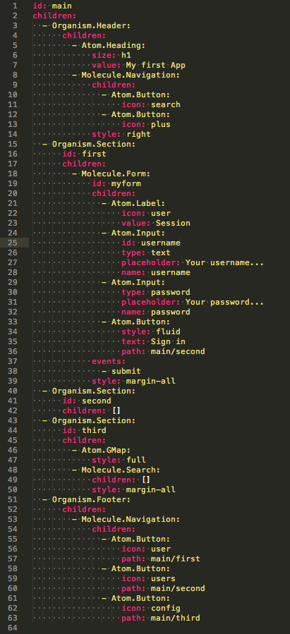

# Atoms
## 10 Comenzando a desarrollar
Una vez descomprimido el archivo zip generado por el IDE debemos ubicarnos con el terminal dentro de la carpeta descomprimida y escribir:

```
sudo npm install
gulp init
gulp
```

Por defecto gulp levantara un servidor en el puerto 8000. Es posible modificar el puerto por defecto en gulpfile.js. Para visualizar el proyecto se debe acceder desde el navegador a localhost:8000

Probando la app generada con el IDE de atoms podemos observar que la navegación entre pantallas funciona sin escribir una sola linea de código. Es más, como puedes observar atoms indica la pantalla en la que estamos remarcando el botón con una clase css llamada “active”. Atoms mediante el path del botón sabe cuando debe añadir o quitar esta clase de modo que sin escribir una sola linea de código ya tenemos la navegación resuelta.

Ahora vamos a escribir la primera linea de código sobre nuestro proyecto descargado, ¿un “hello world”? , no. Vamos a ser más originales, no vamos a escribir en el editor, ni vamos a escribir hello world, escribiremos en la consola del navegador para familiarizarnos con atoms.

Primero vamos a probar a realizar por código el desplazamiento de una pantalla a otra. Abriremos en un editor el archivo source/organisms/main.yml que contiene nuestro scaffold o esqueleto de la aplicación. Puedes utilizar por ejemplo sublimetext para editar yml, coffee y stylus desde el mismo editor de texto.


Probemos con la siguiente linea en la consola:


```
Atoms.Url.path("main/third");
```


¡Felicidades te has desplazado por código de una pantalla a otra! Es una linea muy simple a la que pasamos como parámetro un string con el id del article + / + id de la section a la que cambiar el path. 

Pero no nos mal acostumbremos, esto en la consola esta bien pero recordemos que atoms ha sido desarrollado en coffeescript por lo que en la consola escribiremos javascript y a la hora de crear código en el editor lo haremos en coffeescript, la linea anterior simplemente se escribiría así:


```
Atoms.Url.path "main/third"
```

Fácil, ¿no?. Ahora vamos a explorar las opciones que nos ofrece atoms. Sin salir de la consola del navegador y con nuestra app abierta prueba a escribir lo siguiente sin pulsar enter:


```
__.
```

Al escribir underscore dos veces y un punto, este último desplegara una serie de opciones entre las que se encuentran:

```
__.Article
__.Aside
__.Dialog
__.Entity
```

Las tres primeras opciones son los organismos base sobre los que se desarrolla en Atoms-IDE, son los elementos más complejos los cuales contendrán una serie de hijos. Y como ya estudiamos __.Entity sera nuestro modelo de datos.



Ahora vamos a aprender a navegar por nuestra estructura. Revisa la imagen de main.yml anterior y escribe tu nombre en el primer campo del formulario, ahora escribe en la consola del navegador:


```
__.Article.Main.first.myform.username.value()
```

Estudiemos bien esta linea, estamos recibiendo el valor introducido en el input con id “username” del form con id “myform” de la section con id “first” del article con id “main”.

Existen otras formas de recoger este valor, si nos encontramos editando el archivo main.coffee podríamos escribir dentro del contexto main por lo que escribiriamos:

```
@first.myform.username.value()
```

@ (this) hace referencia a main por lo que solo debemos escribir de main en adelante para recibir el valor del input.

Si quisiésemos mejorar la forma de recibir valores de un formulario podríamos recoger un objeto clave/valor de todos los campos escribiendo:

```
__.Article.Main.first.myform.value()
```

Si nos encontramos en el contexto de main:

```
@first.myform.value()
```

Muy bien, ya hemos hecho una guía rápida de como acceder a los elementos, investiga un poco las diferentes opciones que nos ofrece cada elemento desde la consola y comenzamos a programar en el editor.


###10.1 Desarrollando una app en un editor de texto


Vamos a realizar una sencilla app sobre el ejemplo que tenemos, por ejemplo una agenda. Tiempo estimado: 10-15min. No, no estoy loco ¡veras que fácil es crear con atoms!

Empezaremos creando un archivo source/entities/contact.coffee

```
"use strict"

class __.Entity.Contact extends Atoms.Class.Entity

  @fields "id", "group", "name", "surname", "nick", "phone", "mobilePhone", "email", "photo", "address", "twitter", "facebook"
```

Hemos creado una entidad (extiende de Atoms.Class.Entity) que sera nuestro modelo de datos. En ella definimos unicamente los campos que consideremos debe tener un contacto.

Ahora vamos a crear una Molecule.List de entidades tipo “Contact” y hacer que los elementos Li que contenga esta lista se subscriban a los eventos “create”,”update” y “destroy”. Si, se puede generar con el IDE esa lista y esa subscripción pero dijimos que íbamos a empezar a codificar.

Editamos el archivo main.coffee y generamos en la sección second el siguiente código:

```
  - Organism.Section:
      id: second
      children:
        - Molecule.List:
            id: mylist
            children:
            bind:
              entity: __.Entity.Contact
              atom: Atom.Li
              create: true
              update: true
              destroy: true
              events:
                - touch
```

Ya falta poco para que veamos nuestra agenda en funcionamiento, tenemos dos opciones en este momento extender Atom.Li y crear un atomo LiContact o generar un parse en la entidad “Contact” para especificar en que campos del Atom.Li debe pintar el contenido. Vamos a hacerlo de esta ultima forma, de todos modos en [bitbucket.org](http://https://bitbucket.org/tapquofactory/simpleatomsappdemo) tienes ejemplos de como extender un Atom.Li.

¿Cómo sabemos que campos tiene un Atom.Li? Podemos ver la definición de todos los atomos, moléculas y organismos en el siguiente enlace de github:
[https://github.com/tapquo/atoms-app]https://github.com/tapquo/atoms-app

En nuestro caso el atomo li tiene la siguiente plantilla:

```
@template : """
<li {{#if.style}}class="{{style}}"{{/if.style}}>
{{#if.image}}<figure><span class="icon loading-config"></span></figure>{{/if.image}}
{{#if.icon}}<span class="icon {{icon}}"></span>{{/if.icon}}
<div>
{{#if.info}}<span>{{info}}</span>{{/if.info}}
{{#if.text}}<strong>{{text}}</strong>{{/if.text}}
{{#if.description}}<small>{{description}}</small>{{/if.description}}
</div>
</li>"""
```

Por lo que nuestra entidad contact.coffee tendrá un método parse el cual se llama automáticamente para pintarse en pantalla:

```
"use strict"

class __.Entity.Contact extends Atoms.Class.Entity

  @fields "id", "group", "name", "surname", "nick", "phone", "mobilePhone", "email", "photo", "address", "twitter", "facebook"

  parse: ->
      text    : "#{@name} #{@surname}"
      image   : @photo
      info    : @group
      description: @nick
```


Si escribimos en consola:

```
__.Entity.Contact.create({name:"jon",surname:"perez", nick:"megajon", phone:"6664564xxx"})
```

Y nos posicionamos en la section second veremos que automáticamente al crear la entidad aparece nuestro li y se parsea tal y como hemos escrito.

Vamos a escribir el código en el editor para generar una nueva entidad desde un organismo Dialog que vamos a crear a continuación en /source/organisms/contactDetails.coffee y /source/organisms/contactDetails.yml

Vamos escribir el siguiente código en contactDetails.yml

```
id: contact
children:
  - Organism.Header:
      children:
        - Atom.Heading:
            size: h1
            value: Contact
        - Molecule.Navigation:
            style: right
            children:
              - Atom.Button:
                  icon: close
                  callbacks:
                    - onClose
  - Organism.Section:
      id: body
      children:
        - Molecule.Form:
            id: detailsForm
            children:
              - Atom.Input:
                  name: name
                  type: text
                  placeholder: Name
                  required: true
              - Atom.Input:
                  name: surname
                  type: text
                  placeholder: Surname
                  required: true
              - Atom.Input:
                  name: nick
                  type: text
                  placeholder: Nick...
              - Atom.Input:
                  name: phone
                  type: text
                  required: true
              - Atom.Input:
                  name: mobilePhone
                  type: text
                  required: true
              - Atom.Input:
                  name: photo
                  type: url
              - Atom.Input:
                  name: address
                  type: text
              - Atom.Input:
                  name: twitter
                  type: url
              - Atom.Input:
                  name: facebook
                  type: url
              - Atom.Button:
                  style: fluid
                  text: Save
            events:
              - submit
```

Como podemos apreciar es un simple formulario con los campos definidos en el modelo (entity).
Vamos a controlar los eventos de este dialog de la siguiente manera:
- Hemos creado un callback “onClose” para el botón close, no hemos definido events[“touch”] debido a que los botones como aprendimos anteriormente solo tienen el evento touch.
- Hemos puesto un evento submit al formulario que en el archivo contactDetails.coffee lo recogeremos con la metodologia definida por defecto para los eventos bubble: on+elemento+evento -> onFormSubmit

A continuación vamos a crear el archivo contactDetails.coffee y darle funcionalidad al botón.

```
class Atoms.Organism.ContactDetails extends Atoms.Organism.Dialog

  @scaffold "assets/scaffold/contactDetails.json"

  onClose:()->
    __.Dialog.ContactDetails.hide()


new Atoms.Organism.ContactDetails()
```

Prueba a hacer desde consola un show y un hide para comprobar que el dialog funciona correctamente:

```
__.Dialog.ContactDetails.show()
__.Dialog.ContactDetails.hide()
```


Ahora necesitamos incluir el código para que al hacer click en el boton “+” de la cabecera de nuestra app abra el dialog, intentalo antes de mirar el código siguiente...

Editamos main.coffee:

```
class Atoms.Organism.Main extends Atoms.Organism.Article

  @scaffold "assets/scaffold/main.json"


  onShowDetails:()->
    __.Dialog.ContactDetails.show()

new Atoms.Organism.Main()
```


Editamos main.yml:

```
id: main
children:
  - Organism.Header:
      children:
        - Atom.Heading:
            size: h1
            value: My first App
        - Molecule.Navigation:
            children:
              - Atom.Button:
                  icon: search
              - Atom.Button:
                  icon: plus
                  callbacks:
                    - onShowDetails
            style: right
...
```

El dialog se abre y se cierra como se espera. Simplemente añadiendo al código del dialog la siguiente linea conseguiremos que agregue una entity cada vez que pulsamos en save y automáticamente se mostrara en un li de nuestra lista.

```
  onFormSubmit: (event, dispatcher, hierarchy...) ->
    __.Entity.Contact.create @body.detailsForm.value()
```

¡Ves que fácil! Nuestra app ya funciona! Vamos a mejorarla, cuando alguien pulsa en save el resultado esperado seria que guardase se cerrase el dialog y cuando volvamos a hacer click en el boton “+” los campos estén vacíos...

```
class Atoms.Organism.ContactDetails extends Atoms.Organism.Dialog

  @scaffold "assets/scaffold/contactDetails.json"

  onClose:()->
    do @body.detailsForm.clean
    __.Dialog.ContactDetails.hide()

  onFormSubmit: (event, dispatcher, hierarchy...) ->
    __.Entity.Contact.create @body.detailsForm.value()
    do @onClose

new Atoms.Organism.ContactDetails()
```

El código resultante seria este, como puedes apreciar sin contar la estructura hemos escrito 3 lineas de código!!


###10.2 ¿Cómo podríamos borrar elementos de la lista?
Es muy sencillo simplemente añadiendo una linea en el .yml el evento destroyable hace que al realizar swipeLeft en la lista se borre el elemento li ademas de la entidad:

```
        - Molecule.List:
            id: mylist
            children:
            bind:
              entity: __.Entity.Contact
              atom: Atom.Li
              create: true
              update: true
              destroy: true
              events:
                - touch
                - destroyable
```

Existen otras formas de borrar una entity, por ejemplo usando el método .destroy() sobre una entidad en concreto o .destroyAll() sobre __.Entity.Contact para eliminar todas las entidades "Contact".

###10.3 ¿Cómo podríamos editar un elemento?

Cuando el usuario haga por ejemplo “dobletap” sobre un contacto de la lista mostraremos el mismo dialog pero esta vez cargado con los datos de la entity y lo modificaremos en lugar de crear una entidad nueva:


```
class Atoms.Organism.Main extends Atoms.Organism.Article

  @scaffold "assets/scaffold/main.json"

  onShowDetails:->
    __.Dialog.ContactDetails.show()

  onLiDoubleTap:(event, atom)->
    __.Dialog.ContactDetails.show atom.entity

new Atoms.Organism.Main()
```

Con esto conseguimos pasar a la función show() del dialog “contactDetails” una entity, la cual tendremos que pintar en el formulario:

```
class Atoms.Organism.ContactDetails extends Atoms.Organism.Dialog

  @scaffold "assets/scaffold/contactDetails.json"

  show: (@entity) ->
    super
    if @entity?
      for property in __.Entity.Contact.attributes
        @body.detailsForm["#{property}"].value @entity["#{property}"] if property not in ["uid","className","id"] and @entity["#{property}"]

  onClose:->
    do @body.detailsForm.clean
    __.Dialog.ContactDetails.hide()
    @entity = null

  onFormSubmit: (event, dispatcher, hierarchy...) ->
    if @entity
      @entity.updateAttributes @body.detailsForm.value()
    else
      __.Entity.Contact.create @body.detailsForm.value()
    do @onClose

new Atoms.Organism.ContactDetails()
```

Como podemos ver si pasamos por parámetro una entity recorremos los atributos de la entidad “Contact”, la cual contiene todos los fields definidos más algunos que he desechado ya que no existe input para ellos "uid","className","id".

Esto pintara en el formulario nuestra entity.

###10.4 ¿Cómo podemos realizar una busqueda?
La clase entity nos provee de dos métodos que cubren esta necesidad: find(“uid”) y findBy(“field”,”value”)

```
__.Entity.Contact.find(“uid”) → busca en todas nuestras entidades de tipo “contact” el UID de la enitdad pasado por parámetro.
__.Entity.Contact.findBy(“name”,”jon”) → Busca en todas nuestras entidades de tipo “contact” la entidad con name=jon.
```

El valor devuelto para ambos métodos sera la entidad resultante de la búsqueda.

Tanto find como findBy buscan el valor exacto por lo que si queremos crear un dialog que muestre valores a medida que escribimos (autocomplete) podriamos hacerlo de esta manera.

Primero creamos un dialog llamado search.yml para las busquedas que se mostrara al hacer click en el boton con el icono lupa de la cabecera:

```
id: search
children:
  - Organism.Header:
      children:
        - Atom.Heading:
            size: h1
            value: Search
        - Molecule.Navigation:
            style: right
            children:
              - Atom.Button:
                  icon: close
                  callbacks:
                    - onClose
  - Organism.Section:
      id: section
      children:
        - Molecule.Form:
            id: searchForm
            children:
              - Atom.Select:
                  id: by
                  name: by
              - Atom.Input:
                  id: input
                  name: name
                  type: text
                  placeholder: Search...
                  required: true
                  events:
                    - keyup
                  callbacks:
                    - onSearch
              - Atom.Button:
                  style: fluid
                  icon: search
                  text: Search
        - Molecule.List:
            id: searchList
            events:
              - select
            callbacks:
              - onSelection
```

A continuación creamos el archivo search.coffee

```
class Atoms.Organism.Search extends Atoms.Organism.Dialog

  @scaffold "assets/scaffold/search.json"

  constructor:->
    super
    options = []
    for property in __.Entity.Contact.attributes
      options.push value: property, label: property
      @section.searchForm.by.attributes.options = options
    do @section.searchForm.by.refresh

  onClose:->
    do @clean
    do @hide

  onSearch:->
    do @clean
    searchResults = []
    for id, entity of __.Entity.Contact.all()
      if @section.searchForm.input.value() and entity[@section.searchForm.by.value()].indexOf(@section.searchForm.input.value()) > -1
        listitem = entity.parse()
        listitem.events = ["touch"]
        listitem.entityid = entity.uid
        @section.searchList.appendChild "Atom.Li", listitem

  clean:->
    do @section.searchList.destroyChildren

  onSelection:(event, atom)->
    __.Dialog.ContactDetails.show __.Entity.Contact.find(event.attributes.entityid)

new Atoms.Organism.Search()
```

Es un simple buscador que carga en su constructor el select "by" con los campos de nuestra entidad "Contact".
Cuando se pulsa una tecla en el campo de búsqueda busca en todas las entidades si en el campo seleccionado existe ese texto introducido, si existe añade un elemento li a la lista.

Como puedes ver no hemos utilizado binding, si vas a filtrar sobre una Molecule.List con binding deberias considerar eliminar el bind destroy debido a que al realizar el filtrado estarias borrando la entidad de memoria. Tienes un ejemplo de como realizar el filtrado sobre una lista con binding en [bitbucket](https://bitbucket.org/tapquofactory/atoms-todo)

Puedes descargar el ejemplo completo en nuestro [bitbucket](https://bitbucket.org/tapquofactory) de ejemplos.